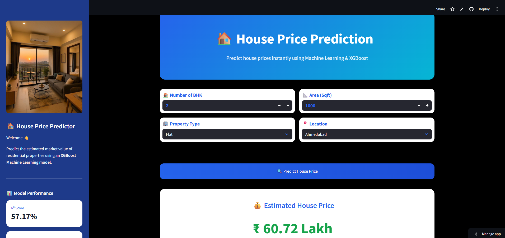
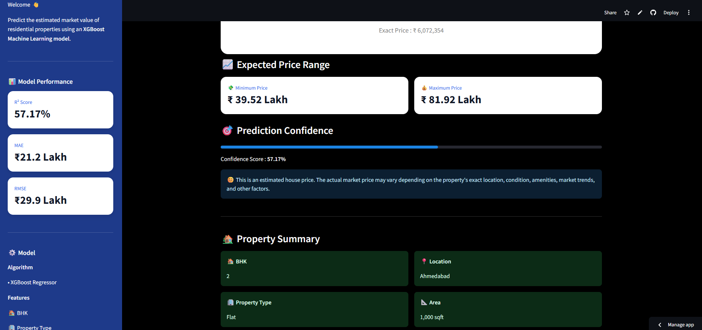
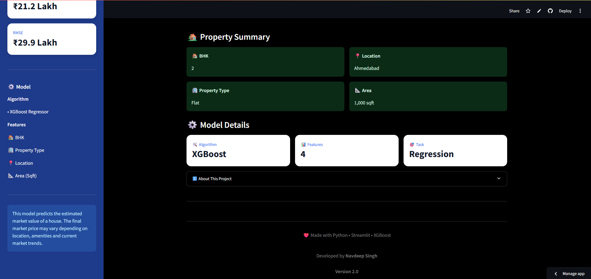

# 🏠 House Price Prediction System

Predict house prices instantly using **Machine Learning** and **XGBoost** with an interactive **Streamlit** web application.

---

## 📸 Preview





---

## 🚀 Live Demo

https://nav-house-prediction.streamlit.app/

---

## 🚀 Features

- 🏠 Predict house prices instantly
- 📍 Select property location
- 🏢 Choose property type
- 📐 Enter property area (Sqft)
- 🛏️ Select number of BHK
- 🤖 XGBoost Regression Model
- 💻 Interactive Streamlit Web App
- 📊 Displays estimated property price
- 📋 Property summary after prediction
- 📈 Model performance metrics

---

## 🧠 Machine Learning Model

**Algorithm Used**

- XGBoost Regressor

### Model Performance

| Metric | Score |
|---------|------:|
| 📈 R² Score | **57.17%** |
| 💰 MAE | **₹21.2 Lakh** |
| 📊 RMSE | **₹29.9 Lakh** |

---

## 📊 Features Used

- 🏠 BHK
- 🏢 Property Type
- 📍 Location
- 📐 Area (Sqft)

---

## 🛠️ Tech Stack

- Python
- Pandas
- NumPy
- Scikit-learn
- XGBoost
- Joblib
- Streamlit

---

## 📂 Project Structure

```text
House_Price_Prediction/
│
├── images
├── app.py
├── columns.pkl
├── hero.jpg
├── House_Price_Data.csv
├── house_price_model.pkl
├── location_encoder.pkl
├── main.ipynb
├── old_UI.py
├── property_encoder.pkl
├── README.md
├── requirements.txt
└──runtime.txt

```

---

## ⚙️ Installation

Clone the repository

```bash
git clone https://github.com/navdeepsinghpro-hub/House_Price_Prediction.git
```

Go to the project folder

```bash
cd House_Price_Prediction
```

Install dependencies

```bash
pip install -r requirements.txt
```

Run the Streamlit application

```bash
streamlit run app.py
```

---

## 💻 How It Works

1. Enter the number of BHK.
2. Select the property type.
3. Select the property location.
4. Enter the property area (Sqft).
5. Click **Predict House Price**.
6. View the estimated house price instantly.

---

## 📌 Future Improvements

- 📈 Improve model accuracy
- 🌍 Google Maps integration
- 📊 Interactive data visualizations
- 💾 Prediction history
- 📄 PDF report generation
- ☁️ Cloud database integration
- 🌙 Dark mode support
- 🏘️ More property features (Bathrooms, Furnishing, Parking, Age, etc.)

---

## ⚠️ Disclaimer

The predicted price is generated by a Machine Learning model and should be considered an estimate only.

Actual market prices may vary depending on:

- Exact property location
- Market trends
- Property condition
- Amenities
- Legal status
- Builder reputation
- Other real-world factors

---

## 👨‍💻 Author

**Navdeep Singh**

🎓 B.Tech AIML Student

⭐ If you like this project, don't forget to star the repository!